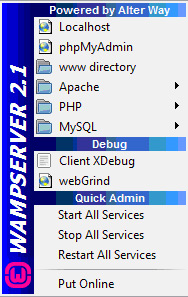
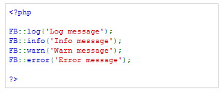

# 2.0 External Debugging Tools

#### 2.1 	XDebug
Xdebug is a PHP extension which provides debugging and profiling capabilities. 

The debug information that Xdebug can provide includes the following:

* stack and function traces in error messages with:
   - full parameter display for user defined functions
   - function name, file name and line indications
   - support for member functions
* memory allocation
* protection for infinite recursions

Xdebug also provides:

* profiling information for PHP scripts[3]
* code coverage analysis
* capabilities to debug your scripts interactively with a debugger front-end.

If you use WAMP Server, it comes already with xDebug:

 
***Figure 5: WAMP Server***

To learn how to use xDebug, please read:

http://devzone.zend.com/article/2803

**2.2 	Firebug**

Firebug (http://getfirebug.com/) is one of those tools that every Web developers should have in his toolbox.  It integrates with Firefox as an extension, but it can be extended by itself, with many other ‘meta-extensions” available for it, like YSlow, FireCookie, PixelPerfect, and FirePHP, which is the main focus of this document.  

The main features of Firebug:
* Inspect HTML and modify style and layout in real-time
* Use the most advanced JavaScript debugger available for any browser
* Accurately analyze network usage and performance
* Extend Firebug and add features to make Firebug even more powerful

**2.3 	FirePHP**

FirePHP is a Mozilla Firefox plugin/extension that merges with Firebug and enables you to log to your Firebug Console using a simple PHP method call. All data is sent via response headers and will not interfere with the content on your page, therefore it is ideally suited for AJAX development where clean JSON and XML responses are required.
 
Issue these calls and this is what you will get in Firebug:

 
***Figure 6: FirePHP with messages in Firebug’s Console***
